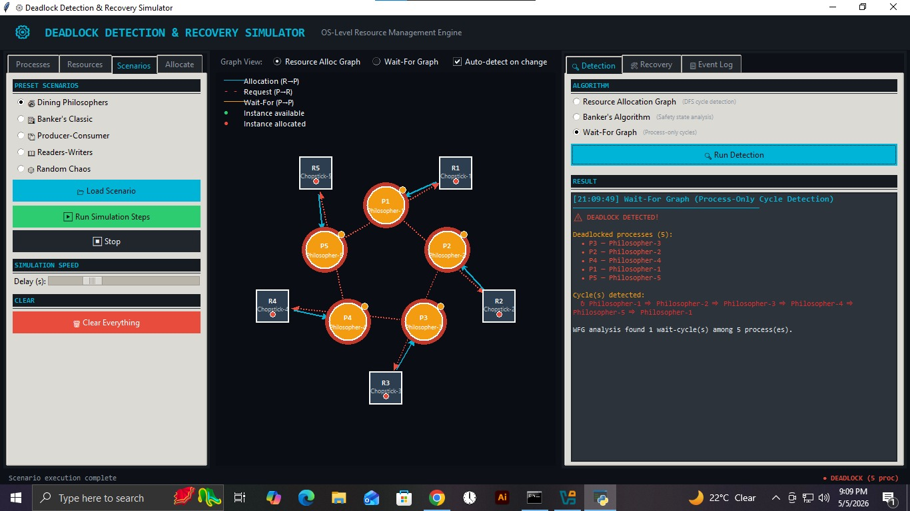
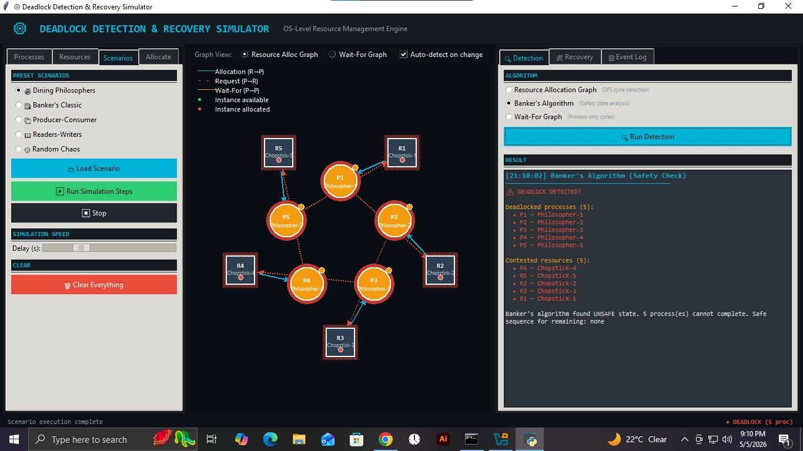
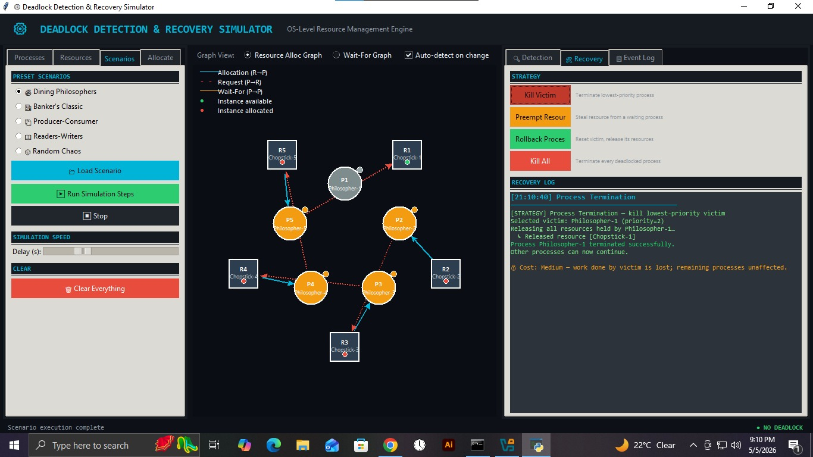
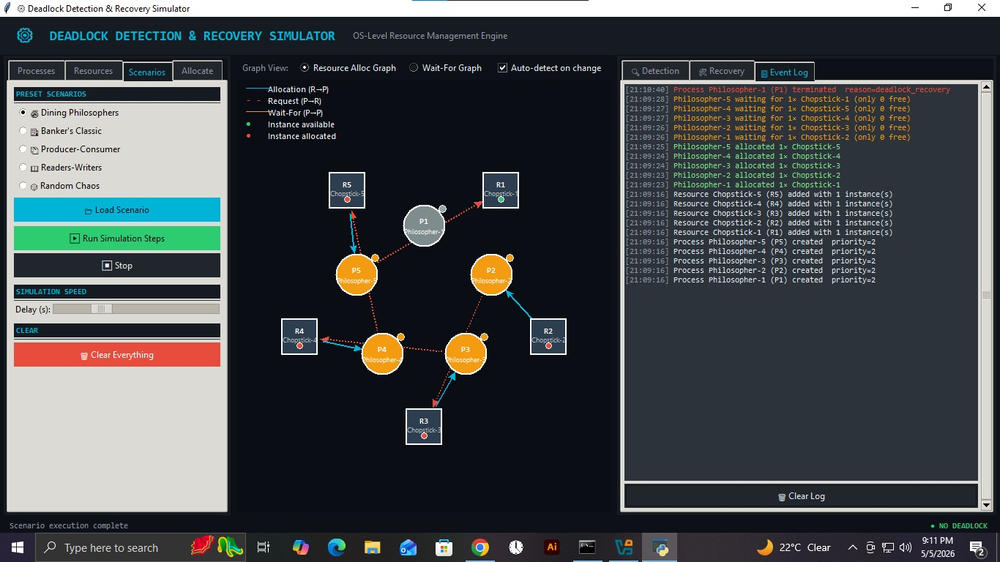

# ⚙️ Deadlock Detection & Recovery Simulator

<div align="center">


**An interactive Operating Systems project that simulates, detects, and automatically recovers from deadlocks using three classic algorithms and four recovery strategies — with a live animated Resource Allocation Graph.**

[Features](#-features) • [Screenshots](#-screenshots) • [Installation](#-installation) • [Usage](#-usage) • [Algorithms](#-algorithms) • [Project Structure](#-project-structure)

</div>

---

## 📌 What is This Project?

In an Operating System, a **deadlock** occurs when two or more processes are each waiting for a resource held by the other — forming a circular dependency that none can escape without external intervention.

This simulator lets you:

- 🔧 **Create** processes and resources manually or load preset scenarios
- 👁️ **Watch** deadlocks form in real time on a live animated graph
- 🔍 **Detect** deadlocks using 3 different OS algorithms
- 🛠️ **Recover** automatically using 4 different strategies
- 📋 **Study** a full timestamped event log of everything that happened

> Built entirely in **pure Python** — no external AI, no cloud APIs, no heavy dependencies.

---

## ✨ Features

### 🖥️ Live Resource Allocation Graph

- Animated canvas that updates in real time
- **Circles** = Processes &nbsp;|&nbsp; **Squares** = Resources
- **Teal arrows** = Resource allocated to process
- **Red dashed arrows** = Process waiting for resource
- **Red glow** = Deadlocked nodes highlighted automatically

### 🔍 Three Detection Algorithms

| Algorithm                 | Method                       | Complexity |
| ------------------------- | ---------------------------- | ---------- |
| Resource Allocation Graph | DFS Cycle Detection          | O(V + E)   |
| Banker's Algorithm        | Safety State Analysis        | O(n² × m)  |
| Wait-For Graph            | Process-Only Cycle Detection | O(P + E')  |

### 🛠️ Four Recovery Strategies

| Strategy             | What It Does                                         | Cost       |
| -------------------- | ---------------------------------------------------- | ---------- |
| **Kill Victim**      | Terminates lowest-priority deadlocked process        | Medium     |
| **Preempt Resource** | Steals resource from one process, gives to another   | Low-Medium |
| **Rollback Process** | Resets process to safe state, releases all resources | Low        |
| **Kill All**         | Terminates every deadlocked process at once          | High       |

### 📦 Five Preset Scenarios

- 🍝 **Dining Philosophers** — 5 processes, 5 chopsticks, classic circular deadlock
- 🏦 **Banker's Classic** — 4 processes, 3 device types, unsafe allocation state
- 📦 **Producer-Consumer** — Buffer mutex + semaphore cross-dependency
- 📖 **Readers-Writers** — Write lock starvation deadlock
- 🎲 **Random Chaos** — Randomly generated, unpredictable deadlock

### ➕ More Features

- ✅ Manual process & resource creation at runtime
- ✅ Auto-detect toggle — detects deadlock on every refresh automatically
- ✅ RAG / WFG graph view toggle
- ✅ Adjustable simulation speed slider
- ✅ Full timestamped event log
- ✅ Headless CLI mode (no GUI required)
- ✅ 18 automated unit tests

---

## 📸 Screenshots

### Resource Allocation Graph — Deadlock Detected

> All 5 Dining Philosophers deadlocked. Red glow on nodes, circular arrows visible.



### Banker's Algorithm — UNSAFE State

> All 5 processes flagged, all 5 resources contested, safe sequence = none.



### Recovery — Kill Victim

> Philosopher-1 terminated, Chopstick-1 freed, deadlock resolved.



### Event Log

> Full timestamped history from process creation to deadlock to recovery.



---

## 🚀 Installation

### Requirements

- Python **3.8** or higher
- Windows / macOS / Linux
- `tkinter` (usually bundled with Python)

### Step 1 — Clone the Repository

```bash
git clone https://github.com/OwaisTanoli71/deadlock-simulator.git
cd deadlock-simulator
```

### Step 2 — Install Dependencies

```bash
pip install -r requirements.txt
```

> `requirements.txt` only contains `psutil` for system monitoring. Everything else is standard library.

### Step 3 — Run

```bash
# Launch GUI
python main.py

# Launch CLI (no GUI needed)
python cli.py dining_philosophers
```

---

## 🎮 Usage

### GUI Mode

1. **Load a Scenario** → Go to `Scenarios` tab → Select `Dining Philosophers` → Click `Load Scenario`
2. **Run Simulation** → Click `Run Simulation Steps` → Watch the graph animate
3. **Detect Deadlock** → Detection runs automatically, or click `Run Detection` manually
4. **Recover** → Go to `Recovery` tab → Click any strategy button
5. **View Log** → Go to `Event Log` tab to see full history

### Manual Mode

1. Go to `Processes` tab → Add processes with name and priority
2. Go to `Resources` tab → Add resources with instance count and type
3. Go to `Allocate` tab → Manually request and release resources
4. Watch the graph update and detection trigger automatically

### CLI Mode

```bash
python cli.py dining_philosophers
python cli.py bankers_classic
python cli.py producer_consumer
python cli.py readers_writers
python cli.py random_chaos
```

---

## 🧠 Algorithms

### Resource Allocation Graph (RAG)

Builds a directed graph where:

- `Process → Resource` = request edge (process is waiting)
- `Resource → Process` = assignment edge (process is holding)

A **cycle in this graph = deadlock**. Uses Depth-First Search with a recursion stack to detect back edges.

### Banker's Algorithm

Simulates whether every process can eventually complete:

1. Build `Allocation`, `Max`, and `Need = Max - Allocation` matrices
2. Find any process whose `Need ≤ Available`
3. "Run" it — add its allocation back to available
4. Repeat until all finish **(safe)** or stuck **(unsafe = deadlock)**

### Wait-For Graph (WFG)

Simplified RAG with only process nodes:

- `P_i → P_j` if P_i is waiting for a resource held by P_j
- Cycle among processes = deadlock
- Faster than full RAG for process-heavy systems

---

## 📁 Project Structure

```
deadlock_simulator/
│
├── main.py                      ← Entry point (GUI)
├── cli.py                       ← Headless CLI demo
├── requirements.txt
├── README.md
│
├── core/
│   ├── resource_manager.py      ← Thread-safe OS resource table
│   ├── deadlock_detector.py     ← RAG / Banker's / WFG algorithms
│   ├── recovery_engine.py       ← 4 recovery strategies
│   └── simulation_engine.py     ← Preset scenarios + background runner
│
├── gui/
│   ├── main_window.py           ← Full Tkinter GUI application
│   └── graph_renderer.py        ← Canvas-based graph visualiser
│
└── tests/
    └── test_core.py             ← 18 automated unit tests
```

---

## 🧪 Running Tests

```bash
python tests/test_core.py
```

```
----------------------------------------------------------------------
Ran 18 tests in 0.076s

OK
```

Tests cover:

- Resource allocation and blocking
- All 3 detection algorithms (2-process and 3-process cycles)
- All 4 recovery strategies
- Priority-based victim selection
- Clean-state (no deadlock) verification

---

## 📚 OS Concepts Covered

| Concept                   | Where in Project                                          |
| ------------------------- | --------------------------------------------------------- |
| Mutual Exclusion          | Resources with limited instances                          |
| Hold and Wait             | Processes hold one resource while requesting another      |
| No Preemption             | Default system behaviour (overridden by preempt strategy) |
| Circular Wait             | Detected by RAG and WFG cycle detection                   |
| Banker's Algorithm        | `deadlock_detector.py` — `_bankers_detection()`           |
| Resource Allocation Graph | `graph_renderer.py` + `deadlock_detector.py`              |
| Process Termination       | `recovery_engine.py` — `_terminate_victim()`              |
| Thread Safety             | `threading.Lock` in `resource_manager.py`                 |

---

## 🔧 Technologies Used

- **Python 3.8+** — Core language
- **Tkinter** — GUI framework (built-in)
- **threading** — Concurrency and thread safety
- **dataclasses** — Clean data modelling
- **unittest** — Automated testing
- **psutil** — System monitoring (optional)

---

## 📖 References

- Silberschatz, Galvin & Gagne — _Operating System Concepts_ (10th ed.)
- Tanenbaum & Bos — _Modern Operating Systems_ (4th ed.)
- Dijkstra, E.W. (1965) — _Solution of a problem in concurrent programming control_
- Coffman, Elphick & Shoshani (1971) — _System Deadlocks_

---

## 👨‍💻 Author

**Owais Tanoli**

- GitHub: [@OwaisTanoli71](https://github.com/OwaisTanoli71)
- Course: Operating Systems — [University Name]

---

## 📄 License

This project is licensed under the MIT License — see the [LICENSE](LICENSE) file for details.

---

<div align="center">

⭐ **If you found this useful, please give it a star!** ⭐

</div>

---

## 🙏 Acknowledgement

I would like to express my sincere gratitude to my **Operating Systems Lab Instructor**, **Ms. Hamna Iqbal**, for her continuous guidance, support, and encouragement throughout this project. Her teaching made complex OS concepts like deadlock detection, resource management, and process synchronization easy to understand and implement practically. This project would not have been possible without her valuable insights and feedback.

- 🔗 GitHub: [@HamnaIqbal44](https://github.com/HamnaIqbal44)
